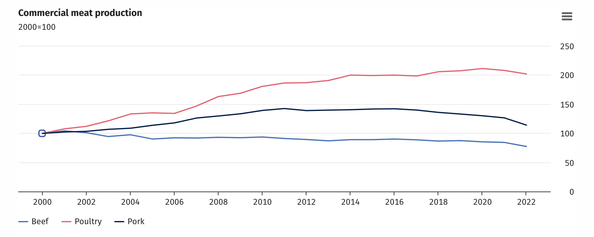
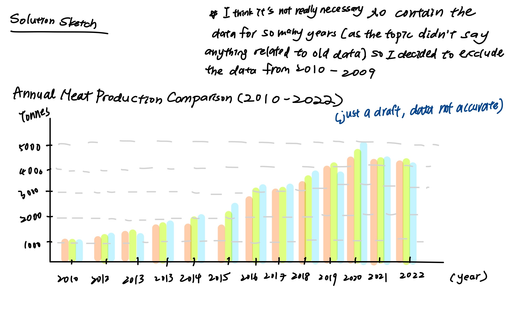
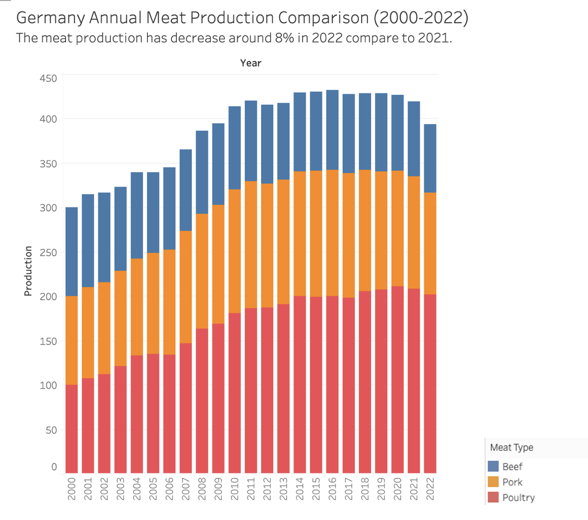

# Assignment 3-4 Critique by Design with Tableau

Assignment 3 & 4 involve the critique of a data visualization using Tableau, sourced from [MakeoverMonday](https://www.makeovermonday.co.uk/data/) 
The task entails selecting a data visualization, thoroughly critiquing its design, and subsequently devising an improved solution. This process includes creating our own visualization, presenting it to a some random audience, gathering feedback on the proposed solution, and iteratively refining it for optimization.

The data I selected is about [Meat Production in Germany](https://www.destatis.de/EN/Press/2023/02/PE23_051_413.html). 
And here is the original table:

For this graph that the article provided, I like the effective use of three distinct colors in this line chart to represent various types of meat. This choice enhances clarity, allowing viewers to quickly grasp the identification of different elements at a glance. Additionally, a thoughtfully crafted title enhances the chart's communicative impact.

However, the map falls short of providing a clear representation of the unit on the y-axis. Additionally, the presence of '2000=100' at the top left of the line graph appears confusing. Without a clearly defined unit, it may be perceived as mathematically ambiguous.

To improve understanding, it is crucial to clearly label the unit of measurement on the y-axis, providing context for the scale being used. Additionally, the notation '2000=100' atop the line graph may introduce confusion without a defined explanation. Consider either removing it if unnecessary or providing a clear legend to elucidate its significance.

## Improving the visulization
I present two versions of the visualizations to enhance clarity and effectively convey the information. In the first version, I excluded data from 2000 to 2009, as it wasn't explicitly addressed in the article. The transition from a line graph to a side-by-side bar chart aims to improve visibility, ensuring that each year is distinctly labeled for a more straightforward interpretation.

The second version is designed to provide a comprehensive view of the changing trend in total meat production over the years. A stacked bar chart is employed to illustrate the overall pattern, allowing for a clear depiction of the total amount while still providing insight into the individual contributions of different meat types on an annual basis. I also added back the data from 2000-2009 to see if it provides a better view.

### The first draft of the improved visulization

<noscript></noscript><object class='tableauViz'  style='display:none;'><param name='host_url' value='https%3A%2F%2Fpublic.tableau.com%2F' /> <param name='embed_code_version' value='3' /> <param name='site_root' value='' /><param name='name' value='Assignment34draft1&#47;draft2' /><param name='tabs' value='no' /><param name='toolbar' value='yes' /><param name='static_image' value='https:&#47;&#47;public.tableau.com&#47;static&#47;images&#47;As&#47;Assignment34draft1&#47;draft2&#47;1.png' /> <param name='animate_transition' value='yes' /><param name='display_static_image' value='yes' /><param name='display_spinner' value='yes' /><param name='display_overlay' value='yes' /><param name='display_count' value='yes' /><param name='language' value='en-US' /><param name='filter' value='publish=yes' /></object>
                

This is the first version of the improved visulization, I interviewed two people for advice on this side by side barchart.
### Feedback on draft 1

**Reader 1. student, mid 20’s**

*Can you tell me what you think this is?*  
From the title, I could tell that this bar chart presents the annual meat production data from 2010-2022.

*Can you describe to me what this is telling you?*  
I could see that for pork and beef, the amount of production hasn’t changed a lot and that poultry is decreasing.

*Is there anything you find surprising or confusing?*  
I wondered if the data was for the whole world or any specific country. And also surprised that I initially thought people were eating more meat than before, but the data seemed to show that people are producing less meat these years.

*Who do you think is the intended audience for this?*  
Maybe someone who wants to invest in the agriculture area, he/she can see the trend of meat production.

*Is there anything you would change or do differently?*  
I would specify which country the data comes from.

**Reader 2. Housewife, mid 50’s**

*Can you tell me what you think this is?*  
I think this is a table that was a side-by-side bar graph that tried to tell the difference between each meat type over the years.

*Can you describe to me what this is telling you?*  
I can see that beef consistently held the position of having the smallest production among the meat types, while pork consistently claimed the title of the meat type with the highest production. The narrative depicted by the bar chart suggests a compelling story of a shifting landscape, with the percentage of pork steadily increasing over time, while poultry shows a discernible decrease in production.

*Is there anything you find surprising or confusing?*  
I wondered if the data was for the whole world or any specific country, and also the trend of the total meat production.

*Who do you think is the intended audience for this?*  
The target audience for this would be the economics who want to learn about the trend of the meat market.

*Is there anything you would change or do differently?*  
I would like to know the total number of meat production.

### The second draft of the improved visulization

### Feedback on draft 2

**Reader 1. student, mid 20’s**

*Is this graph giving a clearer view of the data?*
Yes, from this table, it is clearer to see that this bar chart shows the total meat production over the years, and we can also see the data comes from Germany. But this version is still lack of unit of the x-axis.

**Reader 2. Housewife, mid 50’s**

*Is this graph giving a clearer view of the data?*
Yes, as this provides a better view of the total production of the meat, and we can still somehow see the difference between the number of the different meat types. Also, I like the way that there is a short summary at the top of the bar graph, so I can know what this chart is showing.

**In-class peer review**
The classmates that were discussing with me said that the updated version definately provides a clearer view of the trend of the total production of meat over years (which was what the article was trying to present). However, it's a bit hard to tell the trend for each type of meat.

## Final Solution

<noscript></noscript><object class='tableauViz'  style='display:none;'><param name='host_url' value='https%3A%2F%2Fpublic.tableau.com%2F' /> <param name='embed_code_version' value='3' /> <param name='site_root' value='' /><param name='name' value='Assignment34finalresult&#47;Sheet12' /><param name='tabs' value='no' /><param name='toolbar' value='yes' /><param name='static_image' value='https:&#47;&#47;public.tableau.com&#47;static&#47;images&#47;As&#47;Assignment34finalresult&#47;Sheet12&#47;1.png' /> <param name='animate_transition' value='yes' /><param name='display_static_image' value='yes' /><param name='display_spinner' value='yes' /><param name='display_overlay' value='yes' /><param name='display_count' value='yes' /><param name='language' value='en-US' /><param name='filter' value='publish=yes' /></object>
                

In the final iteration of my project, I chose to use a line graph for its ability to offer a clearer representation of trends over time. Line graphs effectively illustrate the progression or variation of data points along a timeline. The simplicity of this format is particularly advantageous, preventing visual clutter that can arise when dealing with extensive datasets spanning 23 years and three types of meat. This streamlined visualization enhances the audience's ability to discern meaningful patterns in the data. To address the challenge of immediately understanding the overall trend in meat production, I added a line representing the sum of all three meat types.

To improve visibility, I adjusted the placement of data points on the line graph, and marked some important data of the years that the article mentioned, ensuring a clearer distinction between them. Additionally, I included a concise paragraph at the top of the chart summarizing key insights from the article. This serves as a helpful guide for readers interested in quickly grasping the main points before delving into the details presented in the graph.

Furthermore, I encountered discrepancies in the original data from the source, where modified numbers (e.g., "2000=100") were provided. Presuming this to represent 2000kg as 100, I corrected the data to reflect the actual weight of the meat and converted the unit from kilograms to tonnes for a more transparent and accurate representation.

